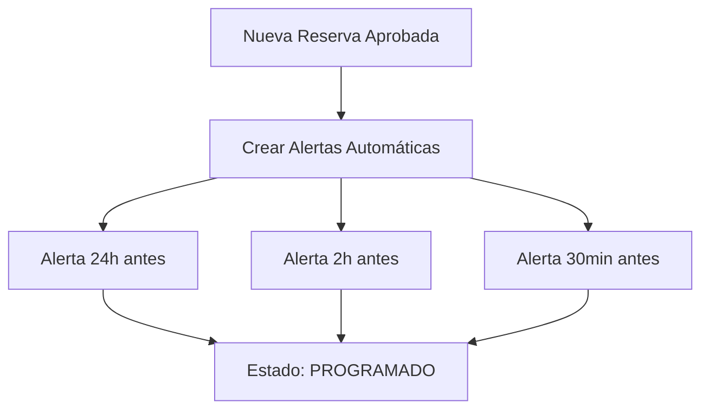
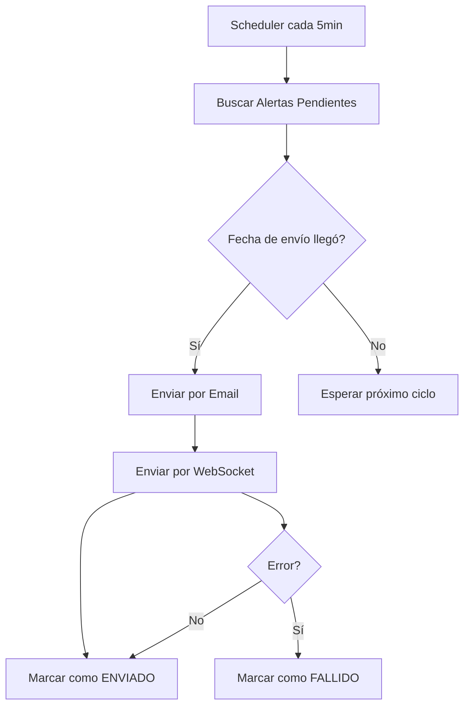
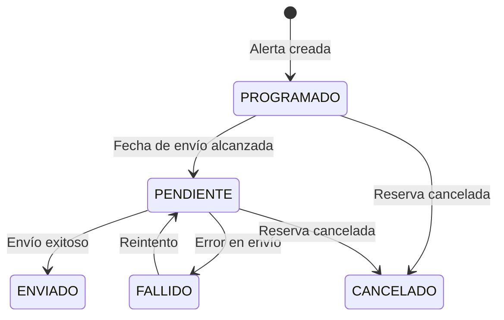

# Sistema de Alertas Automáticas - CampusBookings

## 📖 Descripción General

El Sistema de Alertas Automáticas de CampusBookings permite el envío programado de recordatorios y notificaciones a los usuarios sobre sus reservas, mejorando la experiencia del usuario y reduciendo las no-presentaciones (no-shows).

## ✨ Características Principales

### 🔔 Tipos de Alertas
- **Recordatorio 24h**: Notificación 24 horas antes de la reserva
- **Recordatorio 2h**: Notificación 2 horas antes de la reserva  
- **Recordatorio 30min**: Notificación de última llamada 30 minutos antes
- **Confirmación de Llegada**: Solicitud de confirmación de asistencia
- **Expiración de Reserva**: Notificación cuando una reserva expira
- **Cambio de Estado**: Notificación sobre cambios en el estado de la reserva
- **Cancelación Automática**: Notificación de cancelaciones automáticas

### 📱 Canales de Envío
- **Email**: Plantillas HTML responsivas con branding USCO
- **WebSocket**: Notificaciones en tiempo real en la aplicación
- **Push** (futuro): Notificaciones push para aplicaciones móviles

### ⚡ Procesamiento Automático
- **Tareas Programadas**: Ejecución automática cada 5 minutos
- **Monitoreo de Salud**: Verificación del sistema cada 30 minutos
- **Limpieza Automática**: Mantenimiento nocturno a las 2:00 AM
- **Estadísticas**: Generación de reportes cada 6 horas

## 🏗️ Arquitectura del Sistema

### Backend (Spring Boot)
```
application/
├── dto/
│   ├── request/ConfigurarAlertaRequest.java
│   └── response/AlertaReservaResponse.java
├── service/
│   ├── AlertaReservaService.java
│   └── AlertaSchedulerService.java
├── port/
│   ├── input/AlertaReservaUseCase.java
│   └── output/AlertaReservaRepositoryPort.java
└── mapper/AlertaReservaMapper.java

domain/model/AlertaReserva.java

infrastructure/
├── adapter/
│   ├── input/controller/AlertaReservaController.java
│   └── output/persistence/AlertaReservaPersistence.java
└── config/SchedulingConfig.java
```

### Frontend (Angular + PrimeNG)
```
components/admin/alerts-management/
├── alerts-management.component.ts
├── alerts-management.component.html
└── alerts-management.component.css

services/alert-management.service.ts
```

### Base de Datos
```sql
CREATE TABLE alertas_reservas (
    id BIGINT AUTO_INCREMENT PRIMARY KEY,
    reserva_id BIGINT NOT NULL,
    tipo ENUM(...) NOT NULL,
    fecha_envio DATETIME NOT NULL,
    estado ENUM(...) NOT NULL,
    mensaje TEXT,
    canal_envio VARCHAR(100),
    fecha_enviado DATETIME,
    intentos_envio INT DEFAULT 0,
    motivo_fallo TEXT,
    -- Campos de auditoría
    fecha_creacion DATETIME DEFAULT CURRENT_TIMESTAMP,
    fecha_modificacion DATETIME DEFAULT CURRENT_TIMESTAMP ON UPDATE CURRENT_TIMESTAMP
);
```

## 🔄 Flujo de Trabajo

### 1. Creación Automática de Alertas


### 2. Procesamiento de Alertas


### 3. Gestión de Estados


## 📧 Plantillas de Email

### Estructura de Plantillas
- **Base**: `email-base.html` - Estructura común con branding USCO
- **24h**: `alerta-recordatorio-24h.html` - Recordatorio anticipado
- **2h**: `alerta-recordatorio-2h.html` - Preparación inmediata
- **30min**: `alerta-recordatorio-30min.html` - Última llamada urgente

### Características de las Plantillas
- ✅ Diseño responsivo para móviles y desktop
- ✅ Branding institucional USCO (colores vino tinto #8F141B y ocre)
- ✅ Animaciones CSS para llamar la atención
- ✅ Información completa de la reserva
- ✅ Instrucciones claras para el usuario
- ✅ Enlaces de acción (cuando corresponda)

## ⚙️ Configuración del Sistema

### Tareas Programadas
```java
@Scheduled(fixedRate = 300000) // 5 minutos
public void procesarAlertasPendientes()

@Scheduled(fixedRate = 3600000) // 1 hora  
public void limpiarAlertasVencidas()

@Scheduled(cron = "0 0 2 * * *") // 2:00 AM diario
public void mantenimientoNocturno()

@Scheduled(fixedRate = 1800000) // 30 minutos
public void monitorearSaludSistema()
```

### Parámetros Configurables
- **Tiempos de anticipación**: 24h, 2h, 30min (personalizables)
- **Canales de envío**: Email, WebSocket, Push
- **Máximo de reintentos**: 3 intentos por defecto
- **Tiempo de limpieza**: Alertas completadas después de 30 días

## 🎛️ Panel de Administración

### Funcionalidades del Dashboard
- 📊 **Estadísticas en tiempo real**: Total, pendientes, enviadas, fallidas
- 📋 **Lista completa de alertas** con filtros y búsqueda
- ⚙️ **Configuración personalizada** de tipos y tiempos
- 🔄 **Acciones manuales**: Enviar, cancelar, reenviar
- 🧹 **Limpieza automática** y manual de alertas vencidas
- 📈 **Tasa de éxito** y métricas de rendimiento

### Controles Disponibles
- ✅ Envío manual de alertas individuales
- ✅ Procesamiento masivo de alertas pendientes
- ✅ Cancelación de alertas programadas
- ✅ Reenvío de alertas fallidas
- ✅ Configuración de nuevos tipos de alerta
- ✅ Monitoreo de salud del sistema

## 🔒 Seguridad y Permisos

### Permisos Requeridos
```typescript
// Lectura de alertas
PERMISSIONS.ALERTS.READ

// Gestión de alertas  
PERMISSIONS.ALERTS.CREATE
PERMISSIONS.ALERTS.UPDATE
PERMISSIONS.ALERTS.DELETE
```

### Validaciones de Seguridad
- ✅ Solo administradores pueden gestionar alertas
- ✅ Usuarios solo ven sus propias alertas
- ✅ Validación de ownership en operaciones
- ✅ Logs de auditoría para todas las acciones

## 📊 Monitoreo y Métricas

### Métricas Clave
- **Tasa de éxito de envío**: % de alertas enviadas exitosamente
- **Tiempo promedio de procesamiento**: Latencia del sistema
- **Alertas fallidas**: Número y causas de fallos
- **Distribución por tipo**: Qué alertas se usan más

### Alertas de Sistema
- ⚠️ Tasa de éxito < 90%
- ⚠️ Más de 100 alertas pendientes acumuladas
- ⚠️ Más de 50 alertas fallidas
- ⚠️ Sistema de email inoperativo

## 🚀 Instalación y Despliegue

### Requisitos
- Spring Boot 3.x con @EnableScheduling
- Base de datos MySQL/MariaDB
- Servicio SMTP configurado
- Angular 17+ con PrimeNG

### Pasos de Instalación

1. **Ejecutar migración de base de datos**:
```sql
-- Se ejecuta automáticamente con Flyway
V20250103_002__Create_Alertas_Reservas_Table.sql
```

2. **Configurar propiedades de email**:
```properties
# application.properties
mail.reservas.from=notificaciones@usco.edu.co
mail.reservas.admin-email=admin@usco.edu.co
mail.reservas.subject-prefix=[CampusBookings USCO]
```

3. **Habilitar scheduling**:
```java
@Configuration
@EnableScheduling
public class SchedulingConfig { ... }
```

4. **Configurar rutas frontend**:
```typescript
// app.routes.ts
{ 
  path: 'alertas', 
  loadComponent: () => import('./alerts-management.component')
}
```

## 🔧 Mantenimiento

### Tareas de Mantenimiento Rutinario
- **Diario**: Revisión de alertas fallidas
- **Semanal**: Análisis de tasa de éxito
- **Mensual**: Limpieza de logs antiguos
- **Trimestral**: Optimización de índices de base de datos

### Resolución de Problemas Comunes

#### Alertas no se envían
1. ✅ Verificar configuración SMTP
2. ✅ Revisar logs de errores
3. ✅ Comprobar estado del servicio de scheduling
4. ✅ Verificar conectividad de red

#### Rendimiento lento
1. ✅ Analizar índices de base de datos
2. ✅ Revisar volumen de alertas pendientes
3. ✅ Optimizar consultas SQL
4. ✅ Considerar escalado horizontal

## 📝 Changelog

### v1.0.0 (2025-01-03)
- ✅ Implementación inicial del sistema de alertas
- ✅ Soporte para recordatorios 24h, 2h y 30min
- ✅ Plantillas de email con branding USCO
- ✅ Dashboard administrativo completo
- ✅ Integración con sistema de reservas existente
- ✅ Tareas programadas para procesamiento automático
- ✅ Monitoreo y estadísticas en tiempo real

## 🤝 Contribución

Para contribuir al sistema de alertas:

1. 🔍 Revisar issues abiertos
2. 🌿 Crear rama feature/alertas-nueva-funcionalidad
3. ✅ Escribir tests unitarios
4. 📝 Actualizar documentación
5. 🔄 Crear pull request

## 📞 Soporte

Para soporte técnico del sistema de alertas:
- 📧 Email: soporte.campusbookings@usco.edu.co
- 📋 Issues: GitHub Issues del proyecto
- 📚 Documentación: `/documentation/ALERTAS-SISTEMA-AUTOMATICO.md`

---

*Sistema de Alertas Automáticas - CampusBookings USCO v1.0.0*
*Desarrollado con Spring Boot, Angular y PrimeNG*
