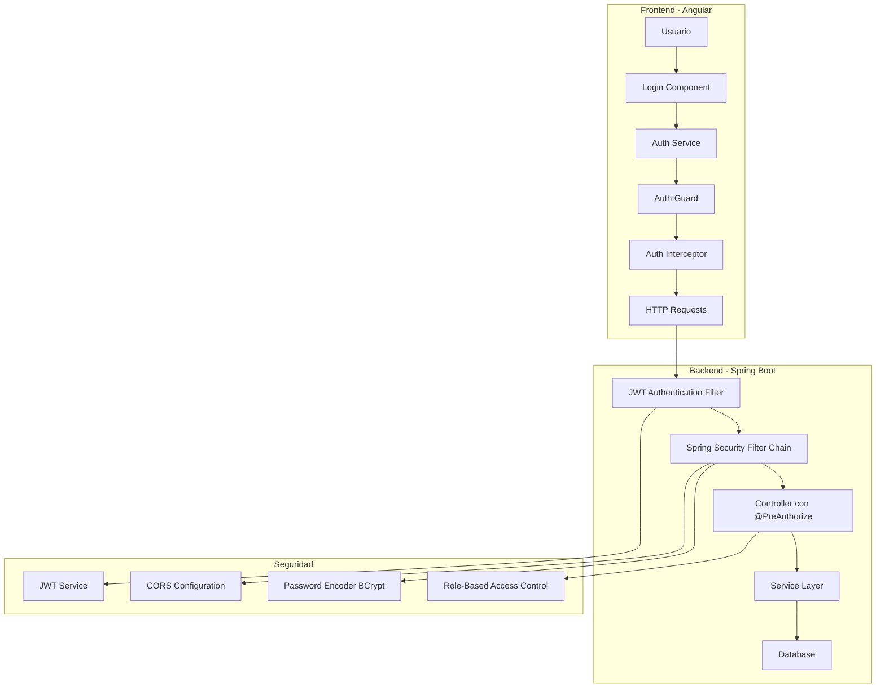

# 🔐 Documentación de Seguridad - Sistema CampusBookings

## 📋 Índice

1. [Resumen Ejecutivo](#resumen-ejecutivo)
2. [Arquitectura de Seguridad](#arquitectura-de-seguridad)
3. [Backend - Spring Security](#backend---spring-security)
4. [Frontend - Angular Security](#frontend---angular-security)
5. [Autenticación y Autorización](#autenticación-y-autorización)
6. [Gestión de Tokens JWT](#gestión-de-tokens-jwt)
7. [Validación de Contraseñas](#validación-de-contraseñas)
8. [Configuraciones de Seguridad](#configuraciones-de-seguridad)
9. [Mejores Prácticas Implementadas](#mejores-prácticas-implementadas)
10. [Recomendaciones Adicionales](#recomendaciones-adicionales)

---

## 🎯 Resumen Ejecutivo

El sistema CampusBookings implementa una arquitectura de seguridad robusta basada en **Spring Security** en el backend y **Angular Guards/Interceptors** en el frontend, utilizando **tokens JWT** para la autenticación y autorización de usuarios.

### 🟢 Características IMPLEMENTADAS y Funcionales:
- ✅ Autenticación basada en JWT (solo access tokens)
- ✅ Autorización por roles (ADMIN, USER) con @PreAuthorize
- ✅ Cifrado de contraseñas con BCrypt (strength 12)
- ✅ Validación avanzada de fortaleza de contraseñas
- ✅ Protección CSRF/CORS configurada
- ✅ Headers de seguridad HTTP básicos
- ✅ Sesiones stateless
- ✅ Guards de autenticación en frontend
- ✅ Interceptors para manejo automático de tokens
- ✅ Auto-logout por expiración de token

### 🟡 Características PARCIALMENTE Implementadas:
- ⚠️ Refresh Tokens (lógica en JwtService pero sin endpoints)
- ⚠️ Rol COORDINATOR (configurado pero no utilizado)

### 🔴 Características NO Implementadas (Features Futuros):
- ❌ Rate Limiting por IP/usuario
- ❌ Two-Factor Authentication (2FA)
- ❌ Audit Logging avanzado
- ❌ Métricas de seguridad en tiempo real
- ❌ Session Management avanzado
- ❌ Cifrado de datos sensibles
- ❌ Testing automatizado de seguridad

---

## 🏗️ Arquitectura de Seguridad



---

## 🛡️ Backend - Spring Security

### Configuración Principal (`SecurityConfig.java`)

#### Características Implementadas:

**1. Configuración de Filtros de Seguridad:**
```java
@Configuration
@EnableWebSecurity
@EnableMethodSecurity
public class SecurityConfig {
    
    // Filtro personalizado JWT antes del filtro estándar
    .addFilterBefore(jwtAuthFilter, UsernamePasswordAuthenticationFilter.class)
    
    // Sesiones stateless para APIs REST
    .sessionManagement(session -> session
        .sessionCreationPolicy(SessionCreationPolicy.STATELESS))
}
```

**2. Autorización por Endpoints:**
```java
.authorizeHttpRequests(auth -> auth
    // Endpoints públicos
    .requestMatchers("/api/auth/**").permitAll()
    .requestMatchers("/swagger-ui/**").permitAll()
    .requestMatchers("/ws/**").permitAll()
    
    // Endpoints protegidos por roles
    .requestMatchers("/api/admin/**").hasRole("ADMIN")
    .requestMatchers("/api/coordinator/**").hasAnyRole("ADMIN", "COORDINATOR")
    
    // Cualquier otra request requiere autenticación
    .anyRequest().authenticated()
)
```

**3. Headers de Seguridad HTTP:**
```java
.headers(headers -> headers
    .frameOptions(frameOptions -> frameOptions.deny())
    .contentTypeOptions(contentTypeOptions -> {})
    .httpStrictTransportSecurity(hstsConfig -> hstsConfig
        .maxAgeInSeconds(31536000)
        .includeSubDomains(true)
    )
)
```

**4. Configuración CORS Avanzada:**
```java
// Orígenes permitidos configurables por ambiente
configuration.setAllowedOrigins(Arrays.asList(
    "http://localhost:4200",      // Angular development
    "http://localhost:3000",      // React development  
    "https://campusbookings.usco.edu.co" // Production
));

// Headers permitidos y expuestos
configuration.setAllowedHeaders(Arrays.asList(
    "Authorization", "Content-Type", "X-Requested-With", 
    "Accept", "Origin", "Access-Control-Request-Method",
    "Access-Control-Request-Headers"
));
```

**5. Cifrado de Contraseñas:**
```java
@Bean
public PasswordEncoder passwordEncoder() {
    // BCrypt con strength 12 para mayor seguridad (por defecto es 10)
    return new BCryptPasswordEncoder(12);
}
```

### Filtro de Autenticación JWT (`JwtAuthenticationFilter.java`)

**Características:**
- Procesamiento automático de tokens Bearer
- Validación de tokens en cada request
- Exclusión automática de endpoints públicos
- Manejo de errores JWT específicos
- Logging de seguridad para auditoría

```java
@Component
public class JwtAuthenticationFilter extends OncePerRequestFilter {
    
    // Endpoints que no requieren autenticación
    private boolean isPublicEndpoint(String requestURI) {
        return requestURI.startsWith("/api/auth/") ||
               requestURI.startsWith("/swagger-ui") ||
               requestURI.startsWith("/ws/");
    }
    
    // Procesamiento del token JWT
    final String jwt = authHeader.substring(7);
    final String userEmail = jwtService.extractUsername(jwt);
    
    if (jwtService.isTokenValid(jwt, userDetails)) {
        // Verificar si no es un refresh token usado como access token
        if (jwtService.isRefreshToken(jwt)) {
            log.warn("Refresh token usado como access token");
            return;
        }
        // Establecer contexto de seguridad
        SecurityContextHolder.getContext().setAuthentication(authToken);
    }
}
```

### Autorización por Métodos

**Uso de `@PreAuthorize` en Controladores:**
```java
// Solo administradores
@PreAuthorize("hasRole('ROLE_ADMIN')")
public ResponseEntity<?> deleteReserva(@PathVariable Long id)

// Administradores o coordinadores
@PreAuthorize("hasRole('ROLE_ADMIN') or hasRole('ROLE_USER')")
public ResponseEntity<?> checkDisponibilidad()

// Usuarios autenticados
@PreAuthorize("hasRole('USER')")
public ResponseEntity<?> getHistorialReservas()
```

### ✅ Endpoints de Autenticación Implementados

**AuthController (`/api/auth/`):**
```java
// ✅ IMPLEMENTADOS
POST /api/auth/register           // Registrar usuario
POST /api/auth/authenticate       // Login de usuario  
GET  /api/auth/me                 // Información usuario actual
POST /api/auth/validate-token     // Validar token JWT
POST /api/auth/validate-password  // Validar fortaleza contraseña
GET  /api/auth/password-requirements // Requisitos de contraseña

// ❌ PENDIENTES
POST /api/auth/refresh            // Renovar access token
POST /api/auth/logout             // Logout con invalidación
POST /api/auth/forgot-password    // Recuperar contraseña
POST /api/auth/reset-password     // Resetear contraseña
POST /api/auth/change-password    // Cambiar contraseña
```

---

## 🔐 Frontend - Angular Security

### Auth Guard (`auth.guard.ts`)

**Protección de Rutas:**
```typescript
@Injectable({ providedIn: 'root' })
export class AuthGuard implements CanActivate {
  canActivate(): boolean | UrlTree {
    if (this.authService.isLoggedIn()) {
      return true;
    }
    
    // Redirección a login con returnUrl
    return this.router.createUrlTree(['/login'], {
      queryParams: { returnUrl: this.router.url }
    });
  }
}
```

### Servicio de Autenticación (`auth.service.ts`)

**Características Principales:**

**1. Manejo de Tokens:**
```typescript
export class AuthService {
  private readonly TOKEN_KEY = 'auth_token';
  private tokenExpirationTimer: any;
  
  // Auto-logout cuando el token expira
  private autoLogout(expirationDuration: number): void {
    if (expirationDuration > 0) {
      this.tokenExpirationTimer = setTimeout(() => {
        this.logout(true);
      }, expirationDuration);
    }
  }
  
  // Verificación de expiración
  private isTokenExpired(token: string): boolean {
    const expiration = this.getTokenExpiration(token);
    return expiration.getTime() < new Date().getTime();
  }
}
```

**2. Decodificación de Tokens JWT:**
```typescript
private checkAuthStatus(): void {
  const token = this.getToken();
  if (token && !this.isTokenExpired(token)) {
    // Decodificar token para obtener información del usuario
    const tokenData: any = jwt_decode.jwtDecode(token);
    
    const user: User = {
      id: tokenData.sub || '',
      email: tokenData.email || '',
      nombre: tokenData.nombre || '',
      apellido: tokenData.apellido || '',
      role: tokenData.rol || 'USER'
    };
    
    this.currentUser.next(user);
    this.isAuthenticated.next(true);
  }
}
```

**3. Gestión de Estado Reactivo:**
```typescript
// BehaviorSubjects para estado reactivo
private isAuthenticated = new BehaviorSubject<boolean>(false);
public currentUser = new BehaviorSubject<User | null>(null);

// Observables públicos
getIsAuthenticated(): Observable<boolean> {
  return this.isAuthenticated.asObservable();
}
```

### Interceptors de HTTP

**1. Auth Interceptor (`auth.interceptor.ts`):**
```typescript
export function authInterceptor(request: HttpRequest<unknown>, next: HttpHandlerFn) {
  const token = authService.getToken();
  
  if (token) {
    request = request.clone({
      setHeaders: {
        Authorization: `Bearer ${token}`
      }
    });
  }
  
  return next(request).pipe(
    catchError((error: HttpErrorResponse) => {
      if (error.status === 401) {
        authService.logout();
        router.navigate(['/login']);
      }
      return throwError(() => error);
    })
  );
}
```

**2. Auth Error Interceptor (`auth-error.interceptor.ts`):**
```typescript
intercept(request: HttpRequest<any>, next: HttpHandler): Observable<HttpEvent<any>> {
  return next.handle(request).pipe(
    catchError((error: HttpErrorResponse) => {
      if (error.status === 401) {
        // Token expirado o no válido
        this.authService.logout();
        this.router.navigate(['/login'], { 
          queryParams: { returnUrl: this.router.routerState.snapshot.url } 
        });
      }
      return throwError(() => error);
    })
  );
}
```

---

## 🎫 Gestión de Tokens JWT

### Servicio JWT Backend (`JwtService.java`)

**Características Avanzadas:**

**1. Configuración de Algoritmos Seguros:**
```java
// HS512 es más seguro que HS256
.signWith(getSignInKey(), SignatureAlgorithm.HS512)

// Secret key de 512 bits para HS512
private Key getSignInKey() {
    byte[] keyBytes = Decoders.BASE64.decode(secretKey);
    return Keys.hmacShaKeyFor(keyBytes);
}
```

**2. Tokens de Acceso (⚠️ Refresh tokens: lógica implementada pero sin endpoints):**
```java
// Access token: 15 minutos
@Value("${jwt.expiration}")
private long jwtExpiration;

// Refresh token: 7 días (IMPLEMENTADO PARCIALMENTE)
@Value("${jwt.refresh.expiration:604800000}")
private long refreshExpiration;

// ❌ PENDIENTE: Endpoint para refresh tokens
public String generateRefreshToken(UserDetails userDetails) {
    Map<String, Object> claims = new HashMap<>();
    claims.put("type", "refresh");
    return buildToken(claims, userDetails, refreshExpiration);
}
```

> **⚠️ NOTA:** Los refresh tokens están implementados a nivel de servicio pero **NO** tienen endpoints expuestos en AuthController.

**3. Claims Personalizados:**
```java
public String generateToken(UserDetails userDetails) {
    Map<String, Object> extraClaims = new HashMap<>();
    
    // Agregar roles como claims
    List<String> roles = userDetails.getAuthorities().stream()
        .map(GrantedAuthority::getAuthority)
        .collect(Collectors.toList());
    extraClaims.put("roles", roles);
    
    return generateToken(extraClaims, userDetails);
}
```

**4. Validación Robusta:**
```java
public boolean isTokenValid(String token, UserDetails userDetails) {
    try {
        final String username = extractUsername(token);
        return username.equals(userDetails.getUsername()) && !isTokenExpired(token);
    } catch (ExpiredJwtException e) {
        log.warn("JWT token expired");
        return false;
    } catch (SignatureException e) {
        log.warn("Invalid JWT signature");
        return false;
    } catch (MalformedJwtException e) {
        log.warn("Invalid JWT token format");
        return false;
    }
    // ... más validaciones
}
```

**5. Metadata de Token:**
```java
private String buildToken(Map<String, Object> extraClaims, UserDetails userDetails, long expiration) {
    return Jwts.builder()
        .setClaims(extraClaims)
        .setSubject(userDetails.getUsername())
        .setIssuedAt(new Date(System.currentTimeMillis()))
        .setExpiration(new Date(System.currentTimeMillis() + expiration))
        .setIssuer("CampusBookings-USCO")
        .setAudience("CampusBookings-Frontend")
        .signWith(getSignInKey(), SignatureAlgorithm.HS512)
        .compact();
}
```

---

## 🔑 Validación de Contraseñas

### Utilidad de Validación (`PasswordValidationUtil.java`)

**Sistema de Puntuación de Fortaleza:**

```java
public static Map<String, Object> validatePasswordStrength(String password) {
    // Validaciones básicas
    boolean hasMinLength = password.length() >= 8;
    boolean hasLowercase = LOWERCASE_PATTERN.matcher(password).matches();
    boolean hasUppercase = UPPERCASE_PATTERN.matcher(password).matches();
    boolean hasDigit = DIGIT_PATTERN.matcher(password).matches();
    boolean hasSpecialChar = SPECIAL_CHAR_PATTERN.matcher(password).matches();
    
    // Sistema de puntuación (0-100)
    int score = 0;
    if (hasMinLength) score += 20;
    if (hasLowercase) score += 15;
    if (hasUppercase) score += 15;
    if (hasDigit) score += 15;
    if (hasSpecialChar) score += 15;
    
    // Bonificaciones por longitud
    if (password.length() >= 12) score += 10;
    if (password.length() >= 16) score += 10;
}
```

**Requisitos de Contraseña:**
- ✅ Mínimo 8 caracteres, máximo 100
- ✅ Al menos una letra minúscula (a-z)
- ✅ Al menos una letra mayúscula (A-Z)
- ✅ Al menos un dígito (0-9)
- ✅ Al menos un carácter especial (@$!%*?&)

**Niveles de Fortaleza:**
- 🔴 **MUY_DEBIL** (0-39 puntos)
- 🟠 **DEBIL** (40-59 puntos)
- 🟡 **MODERADA** (60-79 puntos)
- 🟢 **FUERTE** (80-89 puntos)
- 🔵 **MUY_FUERTE** (90-100 puntos)

---

## ⚙️ Configuraciones de Seguridad

### Variables de Entorno de Seguridad (`application.properties`)

```properties
# ✅ JWT Configuration - IMPLEMENTADO
jwt.secret=7A2F4D6B8E9C1A3F...  # 512 bits para HS512
jwt.expiration=900000             # 15 minutos (mayor seguridad)
jwt.refresh.expiration=604800000  # 7 días (DEFINIDO, endpoints pendientes)

# ✅ CORS Configuration - IMPLEMENTADO
security.cors.allowed-origins=http://localhost:4200,https://campusbookings.usco.edu.co

# ❌ Security Features - NO IMPLEMENTADOS (Definidos pero sin lógica)
# security.rate-limit.requests-per-minute=60
# security.login.max-attempts=5
# security.login.lockout-duration=300000  # 5 minutos
```

### Configuración de Base de Datos
```properties
# Configuración segura de conexión DB
spring.datasource.hikari.maximum-pool-size=10
spring.datasource.hikari.minimum-idle=2
spring.jpa.open-in-view=false  # Previene lazy loading issues
```

---

## ✅ Mejores Prácticas Implementadas

### 🛡️ Seguridad del Backend

1. **Arquitectura Hexagonal**
   - Separación clara entre capas de aplicación e infraestructura
   - Ports & Adapters para mejor testabilidad

2. **Stateless Authentication**
   - Sin almacenamiento de sesiones en servidor
   - Escalabilidad horizontal mejorada

3. **Principio de Menor Privilegio**
   - Autorización granular por endpoints
   - Roles específicos por funcionalidad

4. **Validación en Múltiples Capas**
   - Validación en controllers con `@PreAuthorize`
   - Validación en services y entities
   - Filtros de seguridad en infraestructura

5. **Logging de Seguridad**
   - Registro de intentos de autenticación
   - Logs de tokens inválidos/expirados
   - Auditoría de accesos por roles

### 🎨 Seguridad del Frontend

1. **Reactive Authentication State**
   - Estado centralizado con BehaviorSubjects
   - Sincronización automática entre componentes

2. **Route Protection**
   - Guards en todas las rutas protegidas
   - Redirección automática con returnUrl

3. **Automatic Token Management**
   - Interceptors para inyección automática de tokens
   - Manejo automático de errores 401/403
   - Auto-logout en expiración

4. **Secure Token Storage**
   - LocalStorage para persistencia
   - Verificación de expiración en cada uso
   - Limpieza automática en logout

---

## 🚀 Features Pendientes y Recomendaciones

### 🔧 Features Críticos Pendientes de Implementación

**1. Endpoints de Refresh Token:**
```java
@PostMapping("/refresh")
@Operation(summary = "Renovar token de acceso")
public ResponseEntity<AuthenticationResponse> refreshToken(
    @RequestHeader("Authorization") String refreshToken
) {
    // IMPLEMENTAR: Validar refresh token y generar nuevo access token
}

@PostMapping("/logout")
@Operation(summary = "Logout con invalidación de token")
public ResponseEntity<Map<String, String>> logout(
    @RequestHeader("Authorization") String token
) {
    // IMPLEMENTAR: Invalidar token en blacklist
}
```

**2. Rate Limiting Avanzado:**
```java
@Component
public class RateLimitingFilter implements Filter {
    // Implementar bucket algorithm
    // Limitar requests por IP/usuario
    // Bloqueo temporal por exceso de requests
}
```

**3. Two-Factor Authentication (2FA):**
```java
@Entity
public class UserTwoFactorAuth {
    private String secretKey;
    private boolean enabled;
    private List<String> backupCodes;
}
```

**4. Audit Logging:**
```java
@EventListener
public class SecurityAuditListener {
    public void handleAuthenticationSuccess(AuthenticationSuccessEvent event) {
        // Log successful logins
    }
    
    public void handleAuthenticationFailure(AbstractAuthenticationFailureEvent event) {
        // Log failed attempts
    }
}
```

**5. Session Management Avanzado:**
```java
// Invalidar todas las sesiones del usuario
@Service
public class SessionManagementService {
    public void invalidateAllUserSessions(String username) {
        // Implementar blacklist de tokens
        // Forzar re-autenticación
    }
}
```

**6. Cifrado de Datos Sensibles:**
```java
@Entity
public class Usuario {
    @Encrypted  // Custom annotation
    private String telefono;
    
    @Encrypted
    private String direccion;
}
```

### 🛠️ Herramientas de Monitoreo

**1. Spring Security Events:**
```java
@EventListener
public class AuthenticationEvents {
    @EventListener
    public void onSuccess(AuthenticationSuccessEvent success) {
        // Métricas de login exitoso
    }
    
    @EventListener  
    public void onFailure(AbstractAuthenticationFailureEvent failures) {
        // Alertas de intentos fallidos
    }
}
```

**2. Métricas de Seguridad:**
```java
@Component
public class SecurityMetrics {
    private final MeterRegistry meterRegistry;
    
    public void recordFailedLogin(String reason) {
        Metrics.counter("auth.login.failed", "reason", reason).increment();
    }
}
```

### 📊 Testing de Seguridad

> **❌ ESTADO ACTUAL:** Solo tests unitarios básicos implementados. Tests de seguridad específicos **PENDIENTES**.

**Tests Pendientes de Implementar:**

**1. Tests de Autorización:**
```java
// ❌ PENDIENTE
@Test
public void whenUserAccessesAdminEndpoint_thenForbidden() {
    mockMvc.perform(get("/api/admin/users"))
        .andExpected(status().isForbidden());
}
```

**2. Tests de JWT:**
```java
// ❌ PENDIENTE  
@Test
public void whenTokenExpired_thenUnauthorized() {
    String expiredToken = createExpiredToken();
    mockMvc.perform(get("/api/protected")
        .header("Authorization", "Bearer " + expiredToken))
        .andExpected(status().isUnauthorized());
}
```

---

## 📊 Estado Actual de Implementación

### ✅ **LO QUE FUNCIONA AHORA** (Implementado y Operativo):

**Backend:**
- ✅ Spring Security configurado con JWT
- ✅ Autenticación básica (login/register)
- ✅ Autorización por roles con @PreAuthorize
- ✅ Cifrado BCrypt (strength 12)
- ✅ Validación de fortaleza de contraseñas
- ✅ Headers de seguridad HTTP
- ✅ Configuración CORS
- ✅ Filtros JWT funcionales
- ✅ Sesiones stateless

**Frontend:**
- ✅ Auth Guard para protección de rutas
- ✅ Auth Service con manejo de tokens
- ✅ Interceptors para inyección automática de tokens
- ✅ Manejo de errores 401/403
- ✅ Auto-logout por expiración
- ✅ Estado reactivo de autenticación

**Endpoints Disponibles:**
- ✅ `POST /api/auth/register`
- ✅ `POST /api/auth/authenticate`
- ✅ `GET /api/auth/me`
- ✅ `POST /api/auth/validate-token`
- ✅ `POST /api/auth/validate-password`
- ✅ `GET /api/auth/password-requirements`

### ⚠️ **LO QUE ESTÁ PARCIALMENTE IMPLEMENTADO:**

- ⚠️ **Refresh Tokens:** Lógica en JwtService pero sin endpoints
- ⚠️ **Rol COORDINATOR:** Configurado pero no utilizado

### ❌ **LO QUE NO ESTÁ IMPLEMENTADO** (Pendiente):

**Funcionalidades Críticas:**
- ❌ Endpoints de refresh token (`/api/auth/refresh`)
- ❌ Logout con invalidación (`/api/auth/logout`)
- ❌ Rate limiting por IP/usuario
- ❌ Recuperación de contraseña (`/api/auth/forgot-password`)

**Funcionalidades Avanzadas:**
- ❌ Two-Factor Authentication (2FA)
- ❌ Audit logging de eventos de seguridad
- ❌ Métricas de seguridad en tiempo real
- ❌ Session management avanzado
- ❌ Cifrado de datos sensibles
- ❌ Tests automatizados de seguridad

---

## 📄 Conclusión

El sistema CampusBookings tiene **implementada una base sólida de seguridad** que funciona correctamente para las operaciones básicas de autenticación y autorización. Sin embargo, **faltan características importantes** para considerarlo un sistema de seguridad completo para producción.

### Fortalezas Actuales:
- ✅ Arquitectura de seguridad bien estructurada
- ✅ JWT implementado correctamente
- ✅ Autorización por roles funcional
- ✅ Validación robusta de contraseñas
- ✅ Frontend con manejo reactivo de estado

### 🚧 Roadmap de Implementación Prioritario:

**FASE 1 - Crítico (Corto Plazo):**
1. ✅ **Implementar endpoints de Refresh Token** 
2. ✅ **Agregar rate limiting básico por IP**
3. ✅ **Implementar tests de seguridad automatizados**

**FASE 2 - Importante (Mediano Plazo):**
4. ✅ **Two-Factor Authentication (2FA) para admins**
5. ✅ **Audit logging completo**
6. ✅ **Session management avanzado**

**FASE 3 - Mejoras (Largo Plazo):**
7. ✅ **Métricas de seguridad en tiempo real**
8. ✅ **Cifrado de datos sensibles**
9. ✅ **Tests de penetración automatizados**
10. ✅ **Monitoreo de seguridad avanzado**

---

*Documento generado para el Sistema CampusBookings - Universidad Surcolombiana (USCO)*

*Última actualización: Agosto 2025*