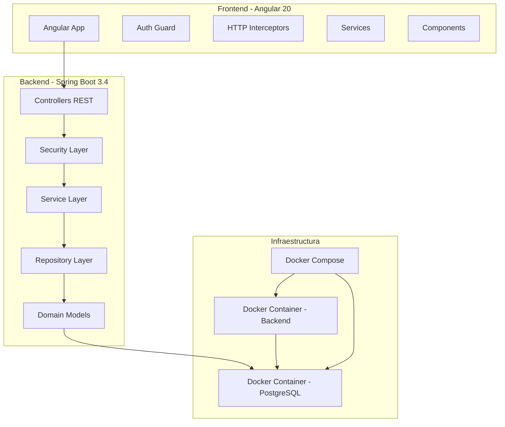
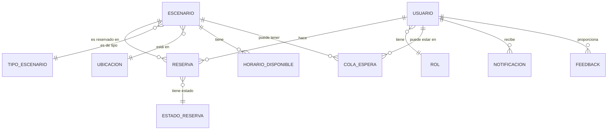

# 🏗️ Documentación Técnica - Sistema CampusBookings

## 📋 Índice

1. [Resumen Ejecutivo](#resumen-ejecutivo)
2. [Stack Tecnológico](#stack-tecnológico)
3. [Arquitectura del Sistema](#arquitectura-del-sistema)
4. [Base de Datos](#base-de-datos)
5. [Estado de Despliegue](#estado-de-despliegue)
6. [Configuración de Entornos](#configuración-de-entornos)
7. [Guía de Instalación Local](#guía-de-instalación-local)
8. [Roadmap de Despliegue](#roadmap-de-despliegue)
9. [Consideraciones de Producción](#consideraciones-de-producción)

---

## 🎯 Resumen Ejecutivo

**CampusBookings** es un sistema integral de reservas para espacios universitarios desarrollado con arquitectura moderna de microservicios. El sistema implementa:

- **Backend:** Spring Boot 3.4.0 con Java 21 y arquitectura hexagonal
- **Frontend:** Angular 20 con PrimeNG y Tailwind CSS
- **Base de Datos:** PostgreSQL 14 con JPA/Hibernate
- **Containerización:** Docker y Docker Compose
- **Estado:** ⚠️ **En desarrollo - No desplegado en producción**

---

## 💻 Stack Tecnológico

### 🔧 Backend (Spring Boot)

| Tecnología | Versión | Propósito |
|------------|---------|-----------|
| **Java** | 21 | Lenguaje base |
| **Spring Boot** | 3.4.0 | Framework principal |
| **Spring Security** | 6.x | Autenticación y autorización |
| **Spring Data JPA** | 3.x | Persistencia de datos |
| **PostgreSQL** | 14 | Base de datos principal |
| **JWT (jjwt)** | 0.11.5 | Tokens de autenticación |
| **MapStruct** | 1.6.3 | Mapeo entre DTOs y entidades |
| **Lombok** | 1.18.36 | Reducción de código boilerplate |
| **OpenAPI/Swagger** | 2.3.0 | Documentación de API |
| **Maven** | 3.x | Gestión de dependencias |

### 🎨 Frontend (Angular)

| Tecnología | Versión | Propósito |
|------------|---------|-----------|
| **Angular** | 20.0.0 | Framework frontend |
| **TypeScript** | 5.8.2 | Lenguaje tipado |
| **PrimeNG** | 19.1.4 | Componentes UI |
| **Tailwind CSS** | 4.1.10 | Framework CSS |
| **JWT Decode** | 4.0.0 | Decodificación de tokens |
| **RxJS** | 7.8.0 | Programación reactiva |
| **Angular CLI** | 20.0.2 | Herramientas de desarrollo |

### 🗄️ Base de Datos y Infraestructura

| Componente | Tecnología | Versión |
|------------|------------|---------|
| **Base de Datos** | PostgreSQL | 14 |
| **ORM** | Hibernate/JPA | 6.x |
| **Containerización** | Docker | Latest |
| **Orchestración** | Docker Compose | 3.x |
| **Build Tool (Backend)** | Maven | 3.x |
| **Build Tool (Frontend)** | npm/Angular CLI | Latest |

---

## 🏛️ Arquitectura del Sistema

### Diagrama de Arquitectura



### Patrones Arquitectónicos Implementados

**1. Arquitectura Hexagonal (Backend):**
```
📁 Application Layer
├── dto/           # DTOs para transferencia de datos
├── port/input/    # Casos de uso (interfaces)
├── port/output/   # Puertos de salida (repositories)
├── service/       # Implementación de casos de uso
└── util/          # Utilidades de aplicación

📁 Domain Layer
└── model/         # Entidades del dominio

📁 Infrastructure Layer
├── adapter/input/     # Controladores REST
├── adapter/output/    # Implementación de repositories
├── config/           # Configuraciones de Spring
└── security/         # Implementación de seguridad
```

**2. Feature-Based Architecture (Frontend):**
```
📁 src/app/
├── components/       # Componentes por funcionalidad
│   ├── dashboard/
│   ├── login/
│   ├── reservation/
│   └── scenario/
├── guards/          # Guards de autenticación
├── interceptors/    # Interceptors HTTP
├── services/        # Servicios compartidos
└── shared/          # Componentes compartidos
```

---

## 🗃️ Base de Datos

### Modelo de Datos

#### Entidades Principales

**1. Usuario (usuarios)**
```sql
CREATE TABLE usuarios (
    id BIGSERIAL PRIMARY KEY,
    nombre VARCHAR(255) NOT NULL,
    apellido VARCHAR(255) NOT NULL,
    email VARCHAR(255) UNIQUE NOT NULL,
    password VARCHAR(255) NOT NULL,
    rol_id BIGINT REFERENCES roles(id),
    created_at TIMESTAMP DEFAULT CURRENT_TIMESTAMP,
    updated_at TIMESTAMP DEFAULT CURRENT_TIMESTAMP
);
```

**2. Escenario (escenario)**
```sql
CREATE TABLE escenario (
    id BIGSERIAL PRIMARY KEY,
    nombre VARCHAR(255) NOT NULL,
    tipo_escenario_id BIGINT NOT NULL REFERENCES tipo_escenario(id),
    ubicacion_id BIGINT NOT NULL REFERENCES ubicacion(id),
    capacidad INTEGER,
    descripcion TEXT,
    recursos TEXT,
    imagen_url VARCHAR(500),
    disponible BOOLEAN DEFAULT true,
    created_at TIMESTAMP DEFAULT CURRENT_TIMESTAMP,
    updated_at TIMESTAMP DEFAULT CURRENT_TIMESTAMP
);
```

**3. Reserva (reserva)**
```sql
CREATE TABLE reserva (
    id BIGSERIAL PRIMARY KEY,
    usuario_id BIGINT NOT NULL REFERENCES usuarios(id),
    escenario_id BIGINT NOT NULL REFERENCES escenario(id),
    estado_id BIGINT NOT NULL REFERENCES estado_reserva(id),
    fecha_inicio TIMESTAMP NOT NULL,
    fecha_fin TIMESTAMP NOT NULL,
    observaciones TEXT,
    motivo_rechazo TEXT,
    created_at TIMESTAMP DEFAULT CURRENT_TIMESTAMP,
    updated_at TIMESTAMP DEFAULT CURRENT_TIMESTAMP
);
```

#### Entidades de Soporte

| Entidad | Propósito |
|---------|-----------|
| **Rol** | Roles de usuario (ADMIN, COORDINATOR, USER) |
| **TipoEscenario** | Clasificación de espacios (Aula, Laboratorio, Auditorio) |
| **EstadoReserva** | Estados de reserva (PENDIENTE, APROBADA, RECHAZADA) |
| **Ubicacion** | Ubicaciones físicas de los escenarios |
| **HorarioDisponible** | Horarios disponibles por escenario |

| **Notificacion** | Notificaciones del sistema |
| **Feedback** | Retroalimentación de usuarios |
| **Reporte** | Reportes del sistema |

### Diagrama de Relaciones



### Configuración de Base de Datos

**Desarrollo (Docker Compose):**
```yaml
services:
  db:
    image: postgres:14
    environment:
      POSTGRES_DB: CampusBookings
      POSTGRES_USER: postgres
      POSTGRES_PASSWORD: secret
    ports:
      - "5440:5432"
```

**Configuración JPA:**
```properties
spring.jpa.hibernate.ddl-auto=update
spring.jpa.show-sql=true
spring.jpa.properties.hibernate.format_sql=true
spring.jpa.open-in-view=false
```

---

## 🚀 Estado de Despliegue

### ⚠️ Estado Actual: **EN DESARROLLO**

El sistema **NO está desplegado en producción** actualmente. El estado es:

| Componente | Estado | Ubicación |
|------------|--------|-----------|
| **Backend** | ✅ Funcional localmente | `localhost:8081` |
| **Frontend** | ✅ Funcional localmente | `localhost:4200` |
| **Base de Datos** | ✅ Docker local | `localhost:5440` |
| **Producción** | ❌ **NO DESPLEGADO** | - |
| **Staging** | ❌ **NO CONFIGURADO** | - |

### Configuración Docker Actual

**Backend (Dockerfile):**
```dockerfile
FROM openjdk:21-jdk
COPY target/CampusBookings-0.0.1-SNAPSHOT.jar /app/CampusBookings-0.0.1-SNAPSHOT.jar
EXPOSE 8081
CMD ["java", "-jar", "/app/CampusBookings-0.0.1-SNAPSHOT.jar"]
```

**Docker Compose:**
- ✅ Base de datos PostgreSQL configurada
- ✅ Backend configurado para contenedor
- ❌ Frontend NO incluido en compose
- ❌ Volúmenes de persistencia básicos

---

## ⚙️ Configuración de Entornos

### Entorno de Desarrollo

**Backend (`application.properties`):**
```properties
# Base de datos
spring.datasource.url=jdbc:postgresql://localhost:5440/CampusBookings
spring.datasource.username=postgres
spring.datasource.password=secret

# Puerto
server.port=8081

# JWT
jwt.expiration=900000  # 15 minutos
```

**Frontend (`environment.ts`):**
```typescript
export const environment = {
  production: false,
  apiUrl: 'http://localhost:8081/api',
  authEndpoint: '/auth',
  defaultLanguage: 'es',
  version: '0.0.1',
  enableDebug: true
};
```

### Entorno de Producción (Configurado pero NO desplegado)

**Frontend (`environment.prod.ts`):**
```typescript
export const environment = {
  production: true,
  apiUrl: 'https://api.campusbookings.com/api', // ⚠️ URL placeholder
  authEndpoint: '/auth',
  defaultLanguage: 'es',
  version: '0.0.1',
  enableDebug: false
};
```

---

## 🛠️ Guía de Instalación Local

### Prerrequisitos

- **Docker & Docker Compose**
- **Java 21** (para desarrollo backend)
- **Node.js 18+** y **npm** (para desarrollo frontend)
- **Maven 3.6+** (para build backend)

### Pasos de Instalación

**1. Clonar Repositorio**
```bash
git clone <repository-url>
cd CampusBookings
```

**2. Iniciar Base de Datos**
```bash
docker-compose up -d db
```

**3. Configurar Backend**
```bash
cd CampusBookings
mvn clean install
mvn spring-boot:run
```

**4. Configurar Frontend**
```bash
cd CampusBookings-Front
npm install
ng serve
```

**5. Acceder al Sistema**
- **Frontend:** http://localhost:4200
- **Backend API:** http://localhost:8081/api
- **Swagger UI:** http://localhost:8081/swagger-ui.html
- **Base de Datos:** localhost:5440

### Verificación de Instalación

```bash
# Verificar backend
curl http://localhost:8081/api/auth/password-requirements

# Verificar frontend
curl http://localhost:4200

# Verificar base de datos
docker exec -it postgres-db psql -U postgres -d CampusBookings -c "\dt"
```

---

## 🚧 Roadmap de Despliegue

### FASE 1: Preparación para Producción (PENDIENTE)

**Backend:**
- [ ] Configuración de perfiles de Spring (dev, test, prod)
- [ ] Variables de entorno para configuración sensible
- [ ] Health checks y métricas
- [ ] Logging estructurado
- [ ] Build optimizado para producción

**Frontend:**
- [ ] Build de producción optimizado
- [ ] Configuración de proxy reverso
- [ ] Optimización de bundles
- [ ] Service Worker para PWA

**Base de Datos:**
- [ ] Scripts de migración con Flyway/Liquibase
- [ ] Backup y recovery procedures
- [ ] Configuración de réplicas
- [ ] Monitoreo de performance

### FASE 2: Infraestructura Cloud (PENDIENTE)

**Opciones de Despliegue:**

**1. AWS (Recomendado)**
```yaml
Servicios Sugeridos:
- EC2/ECS para contenedores
- RDS PostgreSQL para base de datos
- S3 para archivos estáticos
- CloudFront para CDN
- Route 53 para DNS
- Load Balancer
```

**2. Google Cloud Platform**
```yaml
Servicios Sugeridos:
- Google Kubernetes Engine (GKE)
- Cloud SQL PostgreSQL
- Cloud Storage
- Cloud CDN
- Cloud Load Balancing
```

**3. Heroku (Desarrollo/Testing)**
```yaml
Configuración Simple:
- Heroku Dynos para backend
- Heroku PostgreSQL addon
- Heroku Static para frontend
```

### FASE 3: DevOps y CI/CD (PENDIENTE)

**Pipeline Sugerido:**
```yaml
stages:
  - test          # Tests unitarios y de integración
  - build         # Build de aplicaciones
  - security      # Análisis de seguridad
  - deploy-staging # Despliegue a staging
  - deploy-prod   # Despliegue a producción
```

**Herramientas Recomendadas:**
- **CI/CD:** GitHub Actions, GitLab CI, o Jenkins
- **Containerización:** Docker + Kubernetes
- **Monitoreo:** Prometheus + Grafana
- **Logs:** ELK Stack (Elasticsearch, Logstash, Kibana)

---

## 🔧 Consideraciones de Producción

### Seguridad

**Pendientes Críticos:**
- [ ] HTTPS obligatorio
- [ ] Variables de entorno para secrets
- [ ] Rate limiting implementado
- [ ] WAF (Web Application Firewall)
- [ ] Backup automático de base de datos

### Performance

**Optimizaciones Requeridas:**
- [ ] Connection pooling optimizado
- [ ] Caché Redis para sesiones
- [ ] CDN para assets estáticos
- [ ] Compresión gzip/brotli
- [ ] Lazy loading en frontend

### Monitoreo

**Métricas Importantes:**
- [ ] Uptime de servicios
- [ ] Tiempo de respuesta de APIs
- [ ] Uso de CPU/Memoria
- [ ] Conexiones de base de datos
- [ ] Errores 4xx/5xx

### Escalabilidad

**Consideraciones:**
- [ ] Horizontal scaling de backend
- [ ] Separación de read/write DB
- [ ] Microservicios por funcionalidad
- [ ] Auto-scaling basado en métricas

---

## 📊 Métricas del Proyecto

### Estado de Desarrollo

| Componente | Completitud | Estado |
|------------|-------------|--------|
| **Backend Core** | 80% | ✅ Funcional |
| **Frontend Core** | 75% | ✅ Funcional |
| **Autenticación** | 70% | ⚠️ Básico |
| **Reservas** | 85% | ✅ Funcional |
| **Administración** | 60% | ⚠️ En desarrollo |
| **Testing** | 30% | ❌ Insuficiente |
| **Documentación** | 85% | ✅ Buena |
| **Despliegue** | 0% | ❌ No iniciado |

### Líneas de Código (Estimado)

- **Backend (Java):** ~8,000 líneas
- **Frontend (TypeScript):** ~5,000 líneas
- **Configuración:** ~500 líneas
- **Tests:** ~1,500 líneas

---

## 📄 Conclusiones y Recomendaciones

### ✅ Fortalezas del Proyecto

1. **Arquitectura Sólida:** Implementación de arquitectura hexagonal y patrones modernos
2. **Stack Tecnológico Actual:** Uso de versiones recientes y tecnologías maduras
3. **Funcionalidad Core:** Sistema básico de reservas funcional
4. **Seguridad Base:** Implementación básica de autenticación y autorización

### ⚠️ Áreas de Mejora Críticas

1. **Despliegue:** **NO hay estrategia de despliegue definida**
2. **Testing:** Cobertura de tests insuficiente
3. **Documentación Técnica:** Falta documentación de APIs
4. **Configuración de Producción:** No configurado para entornos reales

### 🎯 Próximos Pasos Recomendados

**CORTO PLAZO (1-2 semanas):**
1. Configurar entornos de desarrollo/staging/producción
2. Implementar tests automatizados básicos
3. Configurar CI/CD pipeline básico
4. Documentar APIs con Swagger

**MEDIANO PLAZO (1-2 meses):**
1. Desplegar en entorno de staging
2. Implementar monitoreo básico
3. Configurar backups automatizados
4. Optimizar performance

**LARGO PLAZO (3+ meses):**
1. Despliegue en producción
2. Implementar features avanzadas de seguridad
3. Escalabilidad horizontal
4. Monitoreo avanzado y alertas

---

**Sistema CampusBookings - Universidad Surcolombiana (USCO)**

*Versión: 0.0.1-SNAPSHOT*  
*Estado: En Desarrollo*  
*Última actualización: Diciembre 2024*