# Integración con Google Calendar - CampusBookings

Esta documentación describe la implementación completa de la integración con Google Calendar para sincronizar automáticamente las reservas de escenarios.

## 🚀 Características Implementadas

### Backend (Spring Boot)
- **Autenticación OAuth2** con Google Calendar API
- **Sincronización automática** de reservas con eventos de Google Calendar
- **Gestión de tokens** de acceso y actualización
- **Manejo de errores** robusto con logs detallados
- **Arquitectura hexagonal** manteniendo la separación de responsabilidades

### Frontend (Angular)
- **Componente de configuración** para conectar/desconectar Google Calendar
- **Flujo OAuth2** con ventana emergente
- **Estado reactivo** de la conexión usando signals
- **Interfaz moderna** con PrimeNG y colores USCO
- **Navegación integrada** en el menú de usuario

### Funcionalidades (según Google Calendar API v3)
1. **Conexión/Desconexión** de Google Calendar con OAuth2
2. **Sincronización automática** al crear reservas (solo calendario primario)
3. **Actualización de eventos** al aprobar reservas con notificaciones
4. **Eliminación de eventos** al cancelar reservas con notificaciones
5. **Recordatorios automáticos** configurados (email + popup 15 min antes)
6. **Zona horaria Colombia** (America/Bogota) configurada correctamente
7. **Manejo de errores** específicos de Google API (404, rate limits, etc.)
8. **Ubicación del escenario** incluida en eventos cuando disponible

## 📋 Configuración Requerida

### 1. Google Cloud Console

#### Crear Proyecto y Habilitar API
```bash
1. Ir a Google Cloud Console (https://console.cloud.google.com/)
2. Crear un nuevo proyecto o usar uno existente
3. Habilitar Google Calendar API:
   - Ir a "APIs y servicios" > "Biblioteca"
   - Buscar "Google Calendar API"
   - Hacer clic en "Habilitar"
```

#### Configurar Pantalla de Consentimiento OAuth
```bash
1. Ir a "APIs y servicios" > "Pantalla de consentimiento de OAuth"
2. Seleccionar tipo de usuario:
   - Interno: Solo usuarios de tu organización (G Suite/Workspace)
   - Externo: Cualquier usuario con cuenta de Google
3. Completar información de la aplicación:
   - Nombre de la aplicación: "CampusBookings"
   - Correo de soporte: tu-email@ejemplo.com
   - Logo de la aplicación: (opcional)
   - Dominio de la aplicación: tu-dominio.com
   - Correo del desarrollador: tu-email@ejemplo.com
4. Agregar alcances (scopes) - SOLO el mínimo necesario:
   - https://www.googleapis.com/auth/calendar (acceso completo al calendario)
   - Alternativa más restrictiva: https://www.googleapis.com/auth/calendar.events (solo eventos)
5. Usuarios de prueba (solo para desarrollo):
   - Agregar emails de usuarios que probarán la app
6. Guardar y continuar
```

#### Crear Credenciales OAuth2
```bash
1. Ir a "APIs y servicios" > "Credenciales"
2. Hacer clic en "Crear credenciales" > "ID de cliente OAuth 2.0"
3. Tipo de aplicación: "Aplicación web"
4. Nombre: "CampusBookings Cliente Web"
5. URIs de redirección autorizados:
   - http://localhost:4200/google-calendar/callback (desarrollo)
   - https://tu-dominio.com/google-calendar/callback (producción)
6. Hacer clic en "Crear"
7. Copiar y guardar Client ID y Client Secret
```

### 2. Variables de Entorno

#### Backend (.env o application.properties)
```properties
# Google Calendar Configuration
GOOGLE_CALENDAR_CLIENT_ID=tu-client-id-aqui
GOOGLE_CALENDAR_CLIENT_SECRET=tu-client-secret-aqui
GOOGLE_CALENDAR_REDIRECT_URI=http://localhost:4200/google-calendar/callback
```

#### Frontend (environment.ts)
```typescript
export const environment = {
  production: false,
  apiUrl: 'http://localhost:8081/api'
};
```

### 3. Base de Datos

Las migraciones se ejecutan automáticamente:

```sql
-- V018__add_google_calendar_fields_to_usuarios.sql
ALTER TABLE usuarios 
ADD COLUMN google_access_token VARCHAR(2048),
ADD COLUMN google_refresh_token VARCHAR(512),
ADD COLUMN google_calendar_connected BOOLEAN DEFAULT FALSE;

-- V019__add_google_calendar_event_id_to_reservas.sql
ALTER TABLE reservas 
ADD COLUMN google_calendar_event_id VARCHAR(255);
```

## 🔧 Uso del Sistema

### Para Usuarios

#### 1. Conectar Google Calendar
```
1. Ir a menú de usuario > "Google Calendar"
2. Hacer clic en "Conectar Google Calendar"
3. Autorizar en la ventana emergente
4. ¡Listo! Las reservas se sincronizarán automáticamente
```

#### 2. Estados de Sincronización
- **Reserva Pendiente**: No se crea evento hasta la aprobación
- **Reserva Aprobada**: Se crea/actualiza evento en Google Calendar
- **Reserva Cancelada**: Se elimina evento de Google Calendar

#### 3. Desconectar
```
1. Ir a menú de usuario > "Google Calendar"
2. Hacer clic en "Desconectar"
3. Confirmar la acción
```

### Para Desarrolladores

#### Estructura de Archivos Backend
```
 📁 application/
   📁 dto/
     📁 request/
       📄 GoogleCalendarAuthRequest.java
     📁 response/
       📄 GoogleCalendarStatusResponse.java
   📁 exception/
     📄 GoogleCalendarException.java
   📁 port/
     📁 input/
       📄 GoogleCalendarUseCase.java
     📁 output/
       📄 GoogleCalendarRepositoryPort.java
   📁 service/
     📄 GoogleCalendarService.java

 📁 infrastructure/
   📁 adapter/
     📁 input/
       📁 controller/
         📄 GoogleCalendarController.java
     📁 output/
       📁 persistence/
         📄 GoogleCalendarRepository.java
   📁 config/
     📄 GoogleCalendarConfig.java

 📁 domain/model/
   📄 Usuario.java (modificado)
   📄 Reserva.java (modificado)
```

#### Estructura de Archivos Frontend
```
 📁 services/
   📄 google-calendar.service.ts

 📁 components/
   📁 google-calendar-config/
     📄 google-calendar-config.component.ts
   📁 google-calendar-callback/
     📄 google-calendar-callback.component.ts
```

## 🔍 API Endpoints

### Google Calendar Controller

```http
GET /api/google-calendar/authorization-url
# Obtiene URL de autorización

POST /api/google-calendar/connect
# Conecta con Google Calendar
Content-Type: application/json
{
  "authorizationCode": "código-de-autorización"
}

POST /api/google-calendar/disconnect
# Desconecta Google Calendar

GET /api/google-calendar/status
# Verifica estado de conexión

POST /api/google-calendar/sync-all
# Sincroniza todas las reservas
```

## 🐛 Troubleshooting

### Errores Comunes

#### 1. "Error 400: redirect_uri_mismatch"
```
Solución: Verificar que las URIs de redirección en Google Cloud Console
coincidan exactamente con las configuradas en la aplicación.
```

#### 2. "Tokens expirados"
```
Solución: El sistema maneja automáticamente la renovación de tokens.
Si persiste el error, desconectar y volver a conectar.
```

#### 3. "Usuario no tiene permisos"
```
Solución: Verificar que el usuario tenga permisos para crear eventos
en su calendario de Google.
```

### Logs Útiles
```bash
# Backend (Spring Boot)
2024-01-XX INFO  [GoogleCalendarService] - Usuario usuario@example.com conectado exitosamente a Google Calendar
2024-01-XX INFO  [ReservaService] - Reservation synced with Google Calendar, event ID: abc123

# Frontend (Browser Console)
[GoogleCalendarService] Connection status updated: true
[GoogleCalendarConfigComponent] Authorization successful
```

## 🔒 Seguridad

### Tokens de Acceso
- Los tokens se almacenan encriptados en la base de datos
- Los refresh tokens permiten renovación automática
- Los tokens tienen expiración automática por seguridad

### Permisos de Google Calendar
- Solo se solicitan permisos mínimos necesarios
- Acceso limitado al calendario principal del usuario
- No se accede a calendarios compartidos

### Validaciones
- Verificación de usuario autenticado en todas las operaciones
- Validación de códigos de autorización
- Manejo seguro de errores sin exponer información sensible

## 🔄 Flujo de Sincronización

### Creación de Reserva

```mermaid
graph TD
    A[Usuario crea reserva] --> B[Sistema guarda reserva]
    B --> C{Usuario conectado a Google Calendar?}
    C -->|Sí| D[Crear evento en Google Calendar]
    C -->|No| E[Solo guardar en BD]
    D --> F[Guardar Event ID en reserva]
    F --> G[Reserva creada con sincronización]
    E --> G
```


### Aprobación de Reserva

```mermaid
graph TD
    A[Admin aprueba reserva] --> B[Cambiar estado a APROBADA]
    B --> C{Usuario conectado a Google Calendar?}
    C -->|Sí| D[Crear/actualizar evento]
    C -->|No| E[Solo actualizar BD]
    D --> F[Guardar Event ID]
    F --> G[Reserva aprobada y sincronizada]
    E --> G
```


## 📊 Estadísticas y Monitoreo

### Métricas Disponibles
- Número de usuarios conectados a Google Calendar
- Eventos sincronizados exitosamente
- Errores de sincronización
- Tiempo promedio de sincronización

### Queries Útiles
```sql
-- Usuarios conectados a Google Calendar
SELECT COUNT(*) FROM usuarios WHERE google_calendar_connected = true;

-- Reservas sincronizadas
SELECT COUNT(*) FROM reservas WHERE google_calendar_event_id IS NOT NULL;

-- Reservas pendientes de sincronización
SELECT * FROM reservas r 
JOIN usuarios u ON r.usuario_id = u.id 
WHERE u.google_calendar_connected = true 
AND r.google_calendar_event_id IS NULL 
AND r.estado_id IN (SELECT id FROM estados_reserva WHERE nombre = 'APROBADA');
```

## 🎯 Próximas Mejoras

1. **Sincronización bidireccional** - Detectar cambios en Google Calendar
2. **Calendarios específicos** - Permitir elegir calendario de destino
3. **Recordatorios personalizados** - Configurar alertas en Google Calendar
4. **Invitados automáticos** - Agregar participantes a los eventos
5. **Métricas en dashboard** - Mostrar estadísticas de sincronización

---

## 📞 Soporte

Para problemas con la integración de Google Calendar:

1. Verificar logs del backend y frontend
2. Revisar configuración de Google Cloud Console
3. Validar variables de entorno
4. Comprobar permisos de usuario

**Documentación adicional:**
- [Google Calendar API](https://developers.google.com/calendar/api)
- [OAuth 2.0 Guide](https://developers.google.com/identity/protocols/oauth2)
- [Spring Boot OAuth2](https://spring.io/guides/tutorials/spring-boot-oauth2/)
