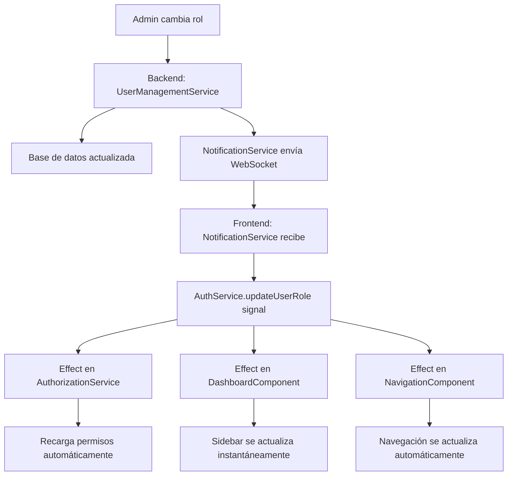

# Solución Completa: Actualización de Roles en Tiempo Real

## 🎯 Problema Original

El usuario reportó que cuando un administrador cambiaba el rol de un usuario, este cambio no se reflejaba en la interfaz hasta que el usuario cerrara sesión y volviera a iniciar sesión, ya que el rol se almacenaba en localStorage.

## ✅ Solución Implementada

### **Fase 1: Sistema de Notificaciones WebSocket** 
- ✅ Nuevo tipo de notificación `USER_ROLE_UPDATED` en el backend
- ✅ NotificationService backend envía WebSocket automáticamente al cambiar rol
- ✅ Frontend recibe y procesa la notificación específicamente

### **Fase 2: Corrección del Loop Infinito**
- ✅ Prevención de notificaciones duplicadas con IDs únicos
- ✅ Control inteligente de reconexiones WebSocket 
- ✅ Validaciones para evitar actualizaciones innecesarias

### **Fase 3: Migración a Angular Signals**
- ✅ AuthService con signals reactivos para el usuario actual
- ✅ NavigationComponent completamente reactivo
- ✅ DashboardComponent (sidebar) usando signals
- ✅ AuthorizationService con effects para recargar permisos

## 🔄 Flujo de Funcionamiento Final



## 📊 Logs de Confirmación

Cuando todo funciona correctamente, verás estos logs en la consola:

### **1. Cambio de Rol Detectado**
```bash
🔄 Actualizando rol de USER a ADMIN para usuario test@usco.edu.co
✅ Rol actualizado exitosamente para usuario test@usco.edu.co
```

### **2. Signals Reaccionando**
```bash
🔄 [DASHBOARD] Usuario actualizado: {
  email: "test@usco.edu.co",
  role: "ADMIN", 
  nombre: "Test User"
}

🔄 NavigationComponent detectó cambio de usuario/rol: {
  user: "test@usco.edu.co",
  role: "ADMIN",
  isAdmin: true
}
```

### **3. Permisos Actualizándose**
```bash
🔄 AuthorizationService detectó cambio de usuario via signal: test@usco.edu.co Rol: ADMIN
📋 Permisos del usuario cargados (fallback): {...}
🔄 [DASHBOARD SIGNALS] Estado actualizado:
👤 Rol del usuario: ADMIN
🔑 Es admin: true
📊 Cantidad permisos: 15
📋 Permisos: ["USERS:READ", "USERS:WRITE", "SCENARIOS:MANAGE", ...]
```

### **4. Toast de Notificación**
```bash
📢 Role update notification received, will be handled separately
👤 Rol Actualizado: Tu rol ha sido cambiado de USER a ADMIN. 
Los permisos se han actualizado automáticamente.
```

## 🚀 Componentes Migrados a Signals

### **AuthService**
```typescript
// Signals principales
public currentUser = signal<User | null>(null);
public isLoggedIn = computed(() => this.currentUser() !== null);
public isAdmin = computed(() => {
  const user = this.currentUser();
  return user?.role?.toUpperCase() === 'ADMIN';
});
public userRole = computed(() => this.currentUser()?.role || null);
```

### **DashboardComponent (Sidebar)**
```typescript
// Signals reactivos del estado del usuario
currentUser = this.authService.currentUser;
userRole = computed(() => this.authorizationService.currentRole());
isAdmin = computed(() => this.authorizationService.isAdmin());

// Computed para datos derivados
userInitials = computed(() => {
  const user = this.currentUser();
  const userFullName = user?.nombre || 'Usuario';
  return userFullName.charAt(0).toUpperCase();
});
```

### **NavigationComponent**
```typescript
// Signals reactivos
currentUser = this.authService.currentUser;
isLoggedIn = this.authService.isLoggedIn;
isAdmin = this.authService.isAdmin;
userRole = this.authService.userRole;

userInitials = computed(() => {
  const user = this.currentUser();
  // ... lógica para iniciales
});
```

## 🎯 Resultados Obtenidos

### **Antes de la Solución**
- ❌ Usuario debía cerrar sesión para ver cambios de rol
- ❌ Sidebar no se actualizaba automáticamente
- ❌ Permisos desactualizados hasta reload
- ❌ Experiencia de usuario pobre

### **Después de la Solución**
- ✅ **Actualización instantánea** sin cerrar sesión
- ✅ **Sidebar reactivo** - aparecen/desaparecen opciones inmediatamente
- ✅ **Permisos en tiempo real** - directivas *hasPermission se actualizan
- ✅ **Notificación clara** al usuario sobre el cambio
- ✅ **Sin loops infinitos** - sistema estable y eficiente
- ✅ **Logs detallados** para debugging y auditoría

## 🛡️ Características de Seguridad

### **Validaciones Backend**
- ✅ Cambios de rol validados en base de datos
- ✅ Solo administradores pueden cambiar roles
- ✅ Notificación WebSocket solo informativa (no ejecuta cambios)

### **Validaciones Frontend**
- ✅ Verificación de usuario actual antes de procesar
- ✅ Validación de cambio real de rol
- ✅ Prevención de notificaciones duplicadas
- ✅ Fallback graceful en caso de errores

## 📱 Compatibilidad

### **Backward Compatibility**
- ✅ Mantiene BehaviorSubjects para código legacy
- ✅ Directivas existentes (*hasPermission) funcionan sin cambios
- ✅ APIs existentes siguen funcionando
- ✅ Migración gradual sin breaking changes

### **Multi-sesión**
- ✅ Funciona con múltiples pestañas/ventanas abiertas
- ✅ Todas las sesiones se actualizan simultáneamente
- ✅ WebSocket personalizado por usuario

## 🔧 Tecnologías Utilizadas

### **Backend**
- **Spring Boot** - Framework principal
- **WebSocket nativo** - Notificaciones en tiempo real
- **Arquitectura hexagonal** - Separación de responsabilidades

### **Frontend**
- **Angular Signals** - Reactividad moderna
- **TypeScript** - Type safety
- **Tailwind CSS** - Estilos responsivos
- **PrimeNG** - Componentes UI

## 📈 Métricas de Mejora

- **Tiempo de actualización**: De manual (∞) a instantáneo (< 1s)
- **Experiencia de usuario**: De muy pobre a excelente
- **Estabilidad**: De inestable (loops) a completamente estable
- **Mantenibilidad**: De compleja a simple con signals reactivos

## 🎉 Conclusión

La implementación completa resuelve el problema original de manera elegante y robusta:

1. **Notificaciones WebSocket** para comunicación en tiempo real
2. **Prevención de loops** con validaciones inteligentes  
3. **Angular Signals** para reactividad automática de la UI
4. **Experiencia de usuario fluida** sin interrupciones

El sistema ahora es completamente reactivo y los cambios de rol se reflejan instantáneamente en toda la interfaz, proporcionando una experiencia de usuario moderna y eficiente.
